# Jambo, brothers.

I'm a student from Russia.

## Stats

  
  
  middle;" />

<!--

  
  

-->

  <picture>
    <source media="(prefers-color-scheme: dark)" srcset="https://raw.githubusercontent.com/miragiee/miragiee/main/github-snake-onedark.svg" />
    <source media="(prefers-color-scheme: light)" srcset="https://raw.githubusercontent.com/miragiee/miragiee/main/github-snake-onedark.svg" />
    
  </picture>

<!--

  <picture>
    <source media="(prefers-color-scheme: dark)" srcset="https://raw.githubusercontent.com/miragiee/miragiee/main/github-snake-dark.svg" />
    <source media="(prefers-color-scheme: light)" srcset="https://raw.githubusercontent.com/miragiee/miragiee/main/github-snake.svg" />
    
  </picture>

-->

### Currently learning
C/C++.

### Wanna learn
Rust.

### Familiar with
Linux, Python, VUE, Vite, CMake, Unity.

### Experienced with
Git, C#, MySQL, PHP, Laravel, HTML, CSS, JavaScript, React, WPF.

### Code Editors
Zed, Visual Studio Code.

  <a href="https://leetcode.com/u/miragiee/">LeetCode</a>
  <!--&nbsp;&nbsp;&nbsp;&nbsp;
  <a href="https://www.codewars.com/users/miragiee">CodeWars</a>-->

<!--
**miragiee/miragiee** is a ✨ _special_ ✨ repository because its `README.md` (this file) appears on your GitHub profile.

Here are some ideas to get you started:

- 🔭 I’m currently working on ...
- 🌱 I’m currently learning ...
- 👯 I’m looking to collaborate on ...
- 🤔 I’m looking for help with ...
- 💬 Ask me about ...
- 📫 How to reach me: ...
- 😄 Pronouns: ...
- ⚡ Fun fact: ...
-->
